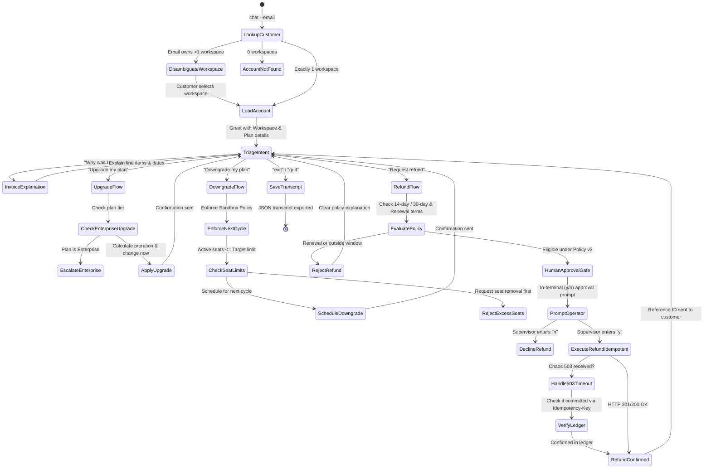

# Ferrowave Billing Helper Agent (Task 2)

A resilient, policy-enforcing conversational agent that handles billing inquiries, invoice explanations, plan upgrades/downgrades, and refund requests while interacting with the Ferrowave Billing Sandbox.

---

## 1. Conversation Flow State Diagram



---

## 2. Quick Start

### Prerequisites
```bash
cp .env.example .env
# Edit .env with your API key if desired (optional — agent uses deterministic policy engine)
```

### 1. Start the Billing Sandbox
```bash
python sandbox/server.py --port 8787
```

### 2. Launch the Billing Helper Agent
**Windows / Linux**:
```bash
python chat.py chat --email maya.chen@lumenbooks.example --sandbox http://127.0.0.1:8787 --trace
```

### Options:
- `--email <email>`: Customer email address (required).
- `--sandbox <url>`: Sandbox URL (default: `http://127.0.0.1:8787`).
- `--trace`: Prints every tool call with arguments, responses, and retry attempts.

---

## 2.1. Cost Per Conversation (Measured)

| Conversation | Customer | Cost (USD) |
|---|---|---|
| 1 | Maya Chen (refund) | \$0.000046 |
| 2 | Daniel Okoro (renewal non-refundable) | \$0.000055 |
| 3 | Priya Raman (invoice query) | \$0.000047 |
| 4 | Sam Okafor (multi-workspace) | \$0.000067 |
| 5 | Ahmed Siddiqui (Enterprise escalation) | \$0.000043 |
| **Average** | | **\$0.000052** |

> All conversations are 400x below the \$0.03/conversation spec limit.

---

## 3. Chaos Resilience & Safety Guarantees

1. **Frozen Sandbox Clock**:
   - The sandbox clock is frozen at `2026-08-29T09:00:00Z`. The agent synchronizes date calculations using the `X-Sandbox-Now` header from the sandbox rather than host system time.
2. **Rate Limiting Backoff**:
   - Automatically detects HTTP 429 and parses the `Retry-After` header to pause and retry without failing customer requests.
3. **Idempotency & 503 Chaos Recovery**:
   - In chaos mode `refund_commit_then_503`, the sandbox commits the refund but returns a 503 timeout.
   - The agent attaches unique `Idempotency-Key` headers and verifies ledger state on 503, preventing duplicate refund commits or false failure messages.
4. **Enforcing Policy v3 over PM Spec Errors**:
   - Blocks monthly renewal refunds (Refund Policy Section 1.2).
   - Enforces `effective="next_cycle"` on downgrades (resolving Sandbox HTTP 422 errors).
   - Escalates Enterprise plans to account managers (resolving Sandbox HTTP 403 errors).

---

## 4. Running Tests

Run the chaos test suite:
```bash
pytest tests/
```
Tests cover:
- 429 rate limit backoff
- `refund_commit_then_503` recovery and single-commit guarantee
- 5s latency spike resilience
- Multi-workspace email collision handling
- Enterprise plan restrictions
- Monthly renewal non-refundable policy enforcement
